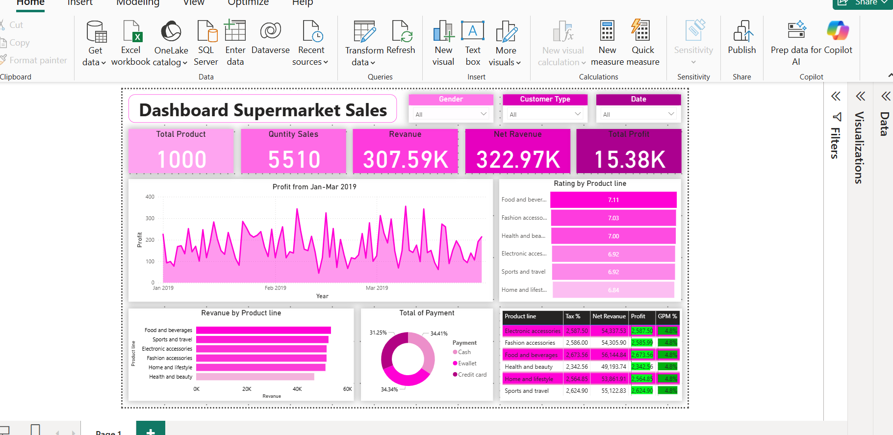

# 📊 Dashboard Supermarket Sales

Proyek ini adalah visualisasi data menggunakan **Power BI** untuk menganalisis penjualan di supermarket. Dashboard ini membantu dalam memantau performa penjualan, profit, rating produk, hingga metode pembayaran yang digunakan pelanggan.  

---

## 🔎 Fitur Dashboard

- **Ringkasan Penjualan**
  - Total Produk: `1000`
  - Quantity Sales: `5510`
  - Revenue: `307.59K`
  - Net Revenue: `322.97K`
  - Total Profit: `15.38K`

- **Visualisasi**
  - Grafik profit bulanan (Jan–Mar 2019)
  - Revenue berdasarkan product line
  - Rating rata-rata tiap product line
  - Distribusi metode pembayaran (Cash, E-wallet, Credit card)
  - Detail Net Revenue, Profit, dan Gross Profit Margin (GPM %) per product line

---

## 🛠 Tools yang digunakan
- **Power BI Desktop**
- Dataset penjualan supermarket (periode Jan–Mar 2019)

---
